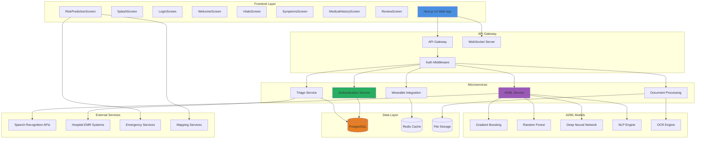
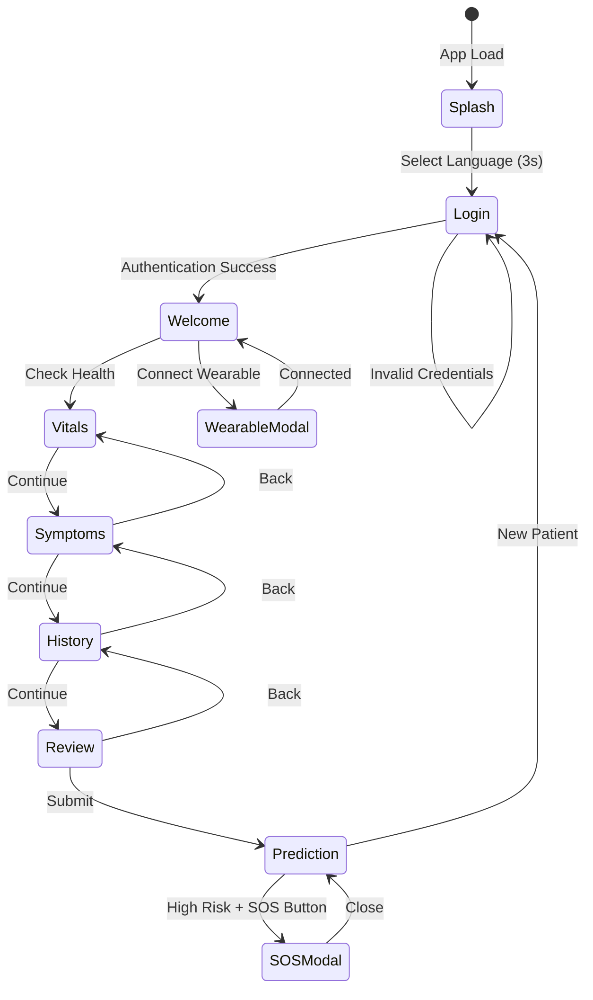
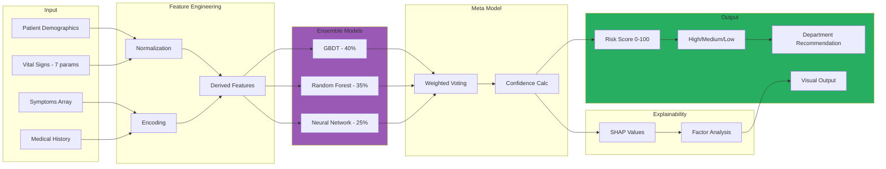
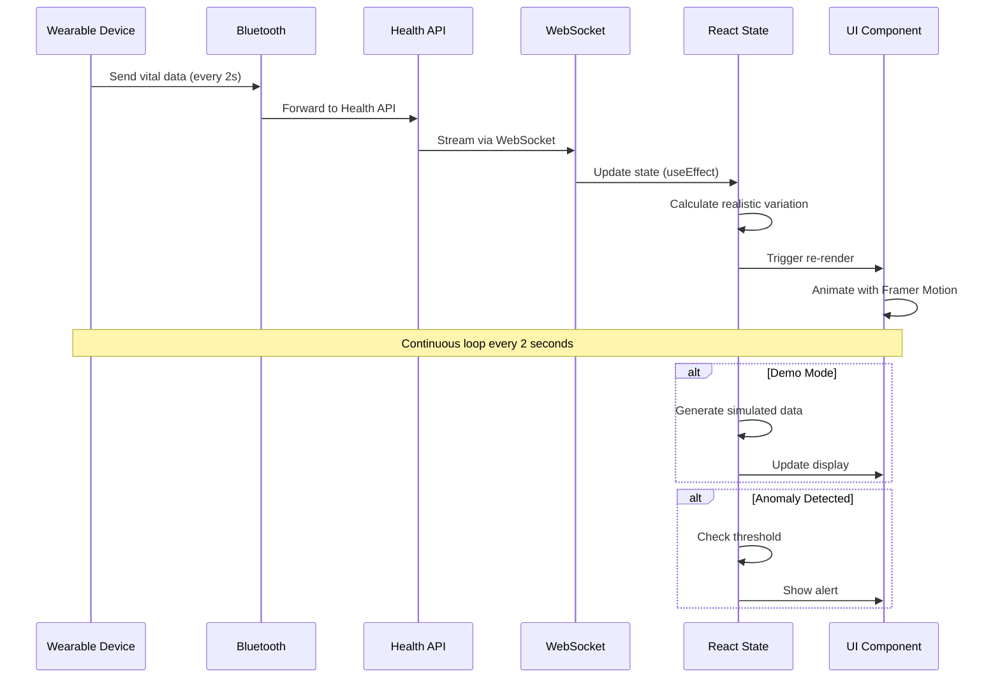
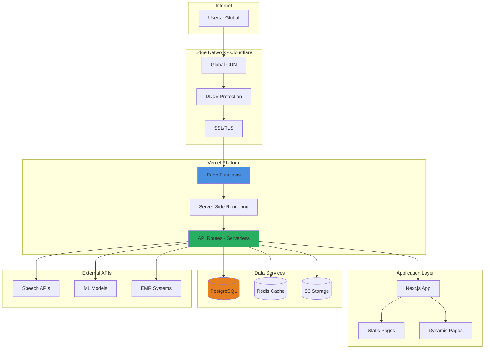
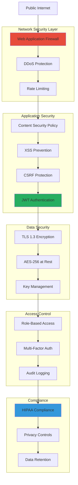

# MedTouch.ai Architecture Diagrams (Mermaid)

## 1. System Architecture

## 2. User Flow Diagram

## 3. Component Hierarchy

```mermaid
graph TD
    App[App - Main State Container]
    App --> Splash[SplashScreen]
    App --> Login[LoginScreen]
    App --> Welcome[WelcomeScreen]
    App --> Vitals[VitalsScreen]
    App --> Symptoms[SymptomsScreen]
    App --> History[MedicalHistoryScreen]
    App --> Review[ReviewScreen]
    App --> Prediction[RiskPredictionScreen]
    
    Splash --> LangSelector[Language Selector]
    Splash --> AnimatedLogo[Animated Logo]
    
    Login --> PatientInput[Patient ID Input]
    Login --> PasswordInput[Password Input]
    Login --> CSVLoader[CSV Data Loader]
    
    Welcome --> PastCharts[Past Data Charts]
    Welcome --> WearableBtn[Wearable Button]
    Welcome --> DemoBtn[Demo Mode Button]
    Welcome --> LiveUpdates[Live Data Updates]
    
    PastCharts --> HRChart[Heart Rate Chart]
    PastCharts --> BPChart[BP Chart]
    PastCharts --> TempDisplay[Temperature]
    
    Vitals --> AgeSlider[Age Slider]
    Vitals --> GenderSelect[Gender Selector]
    Vitals --> HRSlider[Heart Rate Slider]
    Vitals --> TempSlider[Temperature Slider]
    Vitals --> BPSliders[BP Sliders]
    
    Symptoms --> VoiceInput[Voice Input Component]
    Symptoms --> SymptomGrid[Symptom Grid - 60+]
    
    VoiceInput --> SpeechRecognition[Web Speech API]
    VoiceInput --> SymptomMapper[Symptom Mapping]
    
    History --> DocUpload[Document Upload Dropzone]
    History --> DocSummary[Document Summary]
    History --> ConditionSelect[Condition Selector]
    
    Prediction --> RiskGauge[Risk Gauge Component]
    Prediction --> ConfMetrics[Confidence Metrics]
    Prediction --> Factors[Contributing Factors]
    Prediction --> DeptCard[Department Card]
    Prediction --> HospitalList[Hospital List]
    Prediction --> SOSButton[SOS Button]
    
    RiskGauge --> SVGGauge[SVG Speedometer]
    RiskGauge --> AnimatedNeedle[Animated Needle]
    
    style App fill:#4A90E2
    style Prediction fill:#9B59B6
    style RiskGauge fill:#E67E22
```

## 4. ML Pipeline Flow

## 5. Real-Time Data Flow

## 6. Deployment Architecture

## 7. Security Architecture

## Usage

Copy any of these Mermaid diagrams and paste them into:
- GitHub README.md
- Mermaid Live Editor (mermaid.live)
- VS Code with Mermaid extension
- Notion (supports Mermaid)
- GitLab
- Confluence

Or export as:
- PNG image
- SVG vector
- PDF document
